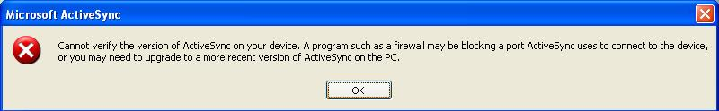
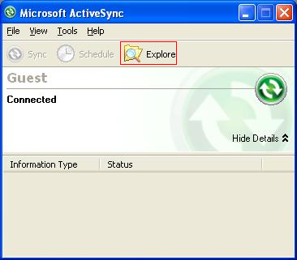
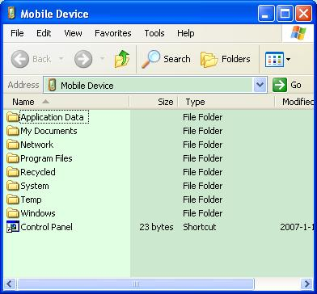
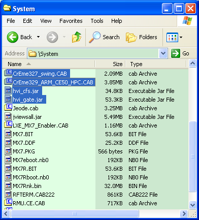
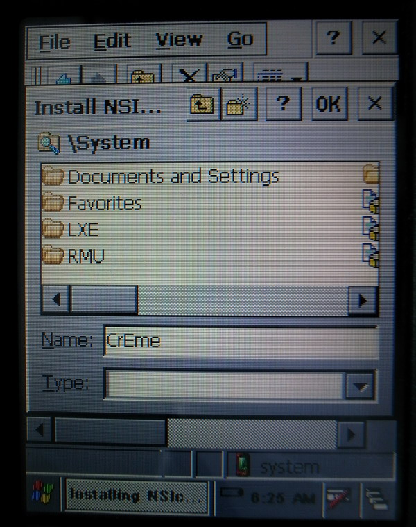
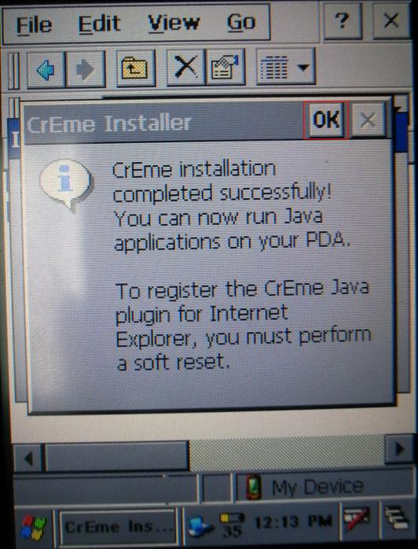
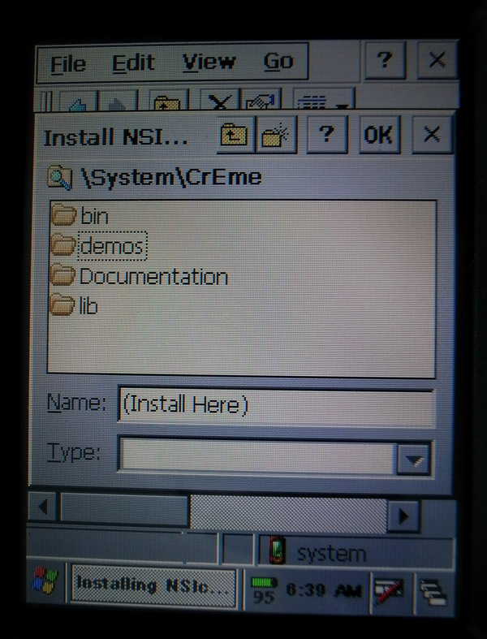

手持终端安装说明
==============

简介
---

> 本文档是关于手持终端安装说明文档，用于说明手持终端安装Java虚拟机和Java应用程序的操作步骤。

应用程序获取
----------

> 应用程序需要从CTROMS系统客户端安装软件自动生成的目录：

1. 从…\\opt\\bhr\\rel\\ctroms\\products\\hvi中拷贝GATE、ROS、CFS、CCI的应用程序。

2. 从…\\opt\\bhr\\rel\\ctroms\\products\\gcs中拷贝CARGO_GATE、CARGO_WAREHOUSE、CARGO_WHARF_SIDE的应用程序。

> 如果服务器IP更换，需要重新生成客户端拷贝相应的程序。

> 也可以用如下方法修改：

- 对于GATE、ROS、CFS、CCI系统的应用程序

> 以CCI为例，用解压缩软件打开应用程序，打开\\hvi_cci.jar\\config\\目录下的Admin_CCI.properties，修改配置项SERVER_IP值为最新的服务器IP值。

- 对于CARGO_GATE、CARGO_WAREHOUSE、CARGO_WHARF_SIDE系统的应用程序

> 以CARGO_GATE为例，用解压缩软件打开应用程序，打开\\hvi_cargo_gate.jar\\config\\目录下的constant.properties，修改配置项SERVER_IP值为最新的服务器IP值。

安装步骤
-------

1. 在Java虚拟机和应用程序所在的PC上安装通讯软件：

> **MicrosoftActiveSync_setup_en.msi**

2. 将手持终端通过USB连接到PC。

> 连接成功后，弹出提示信息，点击确定按钮。

> 在Microsoft ActiveSync操作界面，点击“Explore”，进入“Mobile Device”：

> 注意：

> 手持终端为运行状态时进行连接；

> 如果连接没有成功，请重新尝试连接USB。

3. 在PC上，将Java虚拟机和Java应用程序拷贝到“Mobile Device”的System目录下

4. 断开USB连接

5. 进入手持终端System目录，安装Java虚拟机和应用程序：

    - 双击CrEme329_ARM_CE50_HPC.CAB文件，安装Java虚拟机：

> 弹出对话框，选择安装目录\\System，点击OK按钮

> 安装完成，弹出提示信息，点击OK按钮：

6. 双击CrEme327_swing.CAB文件，安装Swing Jar包

> 弹出对话框，选择安装目录\\System\\CrEme，在Name处输入（Install
> Here）点击OK按钮

7. 在手持终端上，在System目录下，新建文件夹，将Java应用程序从System目录拷贝到\\System\\System目录下

8. 为\\System\\System目录下的Java应用程序创建快捷方式到桌面

安装涉及文件
-----------

| 编号 | 文件名                          | 备注                              |
|------|---------------------------------|-----------------------------------|
|      | MicrosoftActiveSync_setup_en.ms | Windows通讯软件                   |
|      | CrEme329_ARM_CE50_HPC.CAB       | Java虚拟机安装程序                |
|      | CrEme327_swing.CAB              | Swing安装程序                     |
|      | Java应用程序                    | Gate/CFS/CCI/GCS/ROS客户端Jar文件 |
