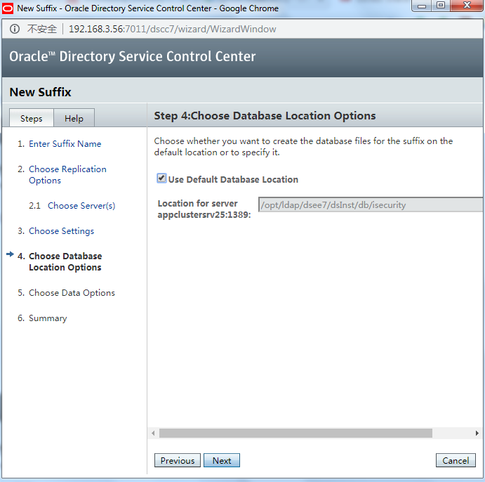

Guide for DSEE 64 bit installation on Linux
===========================================

Install DSEE
------------

```console
# cd /opt/upload

# unzip -q ofm_odsee_linux_11.1.1.7.0_64_disk1_1of1.zip

# cd ODSEE_ZIP_Distribution

# unzip -q sun-dsee7.zip -d /opt/ldap

# cd /opt/ldap/dsee7
```

Create DSCC registry
--------------------

```console
[nodemgr\@appclustersrv25 dsee7]\$ bin/dsccsetup ads-create

Choose password for Directory Service Manager:

Confirm password for Directory Service Manager:

Creating DSCC registry...

DSCC Registry has been created successfully
```

Create DSCC War file
--------------------

```console
[nodemgr\@appclustersrv25 dsee7]\$ bin/dsccsetup war-file-create

Created /opt/ldap/dsee7/var/dscc7.war

[nodemgr\@appclustersrv25 dsee7]\$ bin/dsccsetup status

***

DSCC Registry has been created

Path of DSCC registry is /opt/ldap/dsee7/var/dcc/ads

Port of DSCC registry is 3998

***
```

Create DSCC Agent
--------------------

```console
[nodemgr\@appclustersrv25 dsee7]\$ bin/dsccagent create

DSCC agent will use the following port: 3997

Enter DSCC agent password:

Confirm the password:

Agent instance /opt/ldap/dsee7/var/dcc/agent has been created successfully

Run the following command to register the agent in the registry :
/opt/ldap/dsee7/bin/dsccreg add-agent /opt/ldap/dsee7/var/dcc/agent
```

Add Agent
--------------------
```console
[nodemgr\@appclustersrv25 dsee7]\$ bin/dsccreg add-agent
/opt/ldap/dsee7/var/dcc/agent

Agent path: /opt/ldap/dsee7/var/dcc/agent

Enter DSCC agent "/opt/ldap/dsee7/var/dcc/agent" password:

Enter DSCC administrator's password:

Agent instance has been registered in DSCC on appclustersrv25

You can now run dsccagent start to start the agent

[nodemgr\@appclustersrv25 dsee7]\$ bin/dsccagent start

The agent /opt/ldap/dsee7/var/dcc/agent has been started
```

Deploy war file
---------------

- Login DSCC, create new server


> Confirm server is started


- Copy 99user.ldif to /opt/ldap/dsee7/dsInst/config/schema

- Then restart directory server

```console
[nodemgr\@appclustersrv25 dsee7]\$ bin/dsadm restart '/opt/ldap/dsee7/dsInst'

Directory Server instance '/opt/ldap/dsee7/dsInst' stopped

Directory Server instance '/opt/ldap/dsee7/dsInst' started: pid=27400
```

- Creating an empty suffix and populate it with data via DSCC

> Go to Directory Servers \> Suffixes \> New Suffix. Follow the screenshots, its
> self-explanatory





> Go to Directory Servers \> Suffixes and confirm that dc=isecurity,dc=com suffix
> is created


- Add new Access Control Instruction(ACI)

> Go to Directory Servers \> appclustersrv25:1389 \> Entry Management \> Access
> Control


> Name : iPROS ACI


> For Replication configuration refer to \<\< iPROS 64 linux WLS12c Installation
> Guide 2018.docx \>\> --- 14) Configure LDAP Server Replication
